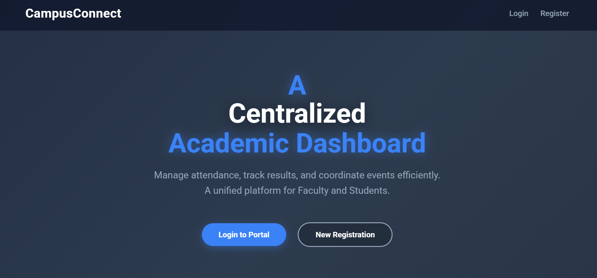
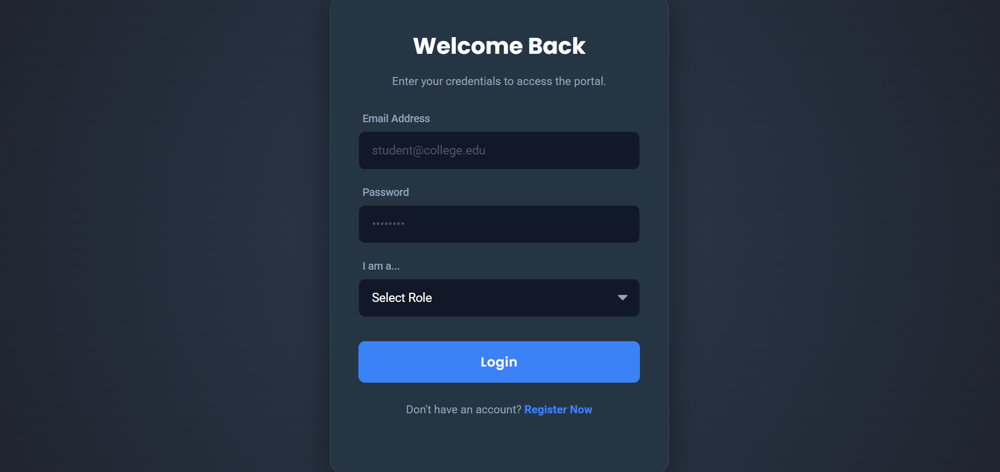
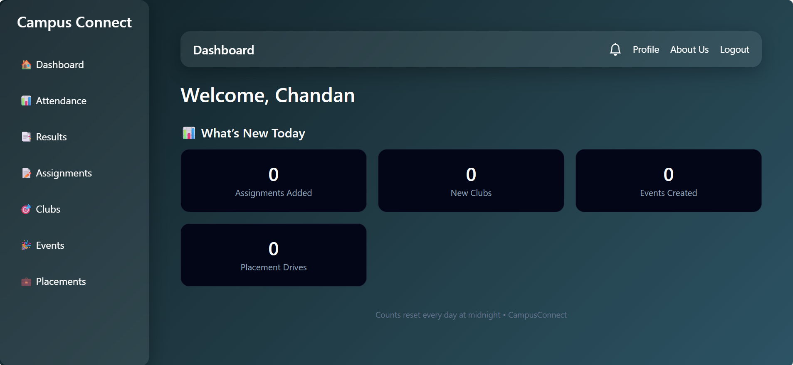

# 🎓 Campus Connect

> A centralized college communication and management platform built using Django.

## 📌 Problem Statement

During our initial days in college, we faced difficulty accessing important information because it was scattered across WhatsApp groups, Google Forms, and notice boards. Many students missed deadlines and updates.

There was no centralized system to manage academic activities, clubs, and placement drives.

## 💡 Proposed Solution

Campus Connect provides a centralized platform where:

- Students receive announcements in one place
- Faculty can upload assignments
- Clubs can post updates
- Placement drives are managed systematically
- Role-based dashboards ensure organized access

## 🚀 Features

- 🔐 Secure Login System
- 👨‍🎓 Student Dashboard
- 👨‍🏫 Faculty Dashboard
- 📝 Assignment Management
- 📢 Announcement System
- 🎯 Club & Society Updates
- 💼 Placement Drive Notifications

## 🛠 Tech Stack

Backend: Django (Python)  
Frontend: HTML, CSS  
Database: SQLite3 
Version Control: Git & GitHub

## ⚙️ Installation & Setup

1. Clone the repository - 
git clone https://github.com/chandan-maurya-commits/CampusConnect.git

2. Navigate into folder -  
cd CampusConnect

3. Create virtual environment - 
python -m venv env

4. Activate environment - 
env\Scripts\activate

5. Install dependencies - 
pip install -r requirements.txt

6. Apply migrations - 
python manage.py migrate

7. Run server -  
python manage.py runserver

## 📂 Project Structure

```
CampusConnect/
│
├── campus/          # Main project configuration
├── student/         # Student management app
├── templates/       # HTML templates
├── manage.py        # Django management script
└── requirements.txt # Project dependencies
```

---

## 📸 Screenshots

### 🔹 Landing Page



## 📸 Screenshots

### Landing Page


### Login Page


### Student Dashboard


## 📈 Future Improvements

- Email notifications
- Cloud deployment (Render / AWS)
- Admin analytics dashboard
- Mobile responsive UI
- AI-based student activity analysis

## 👨‍💻 Author

Chandan Maurya  
B.Tech Computer Science & Engineering  


